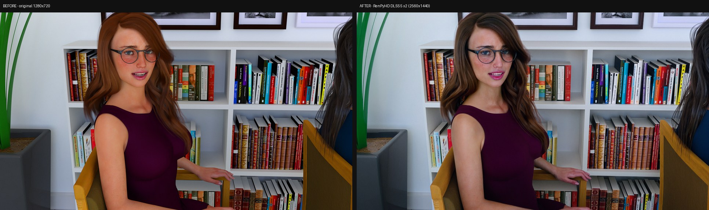
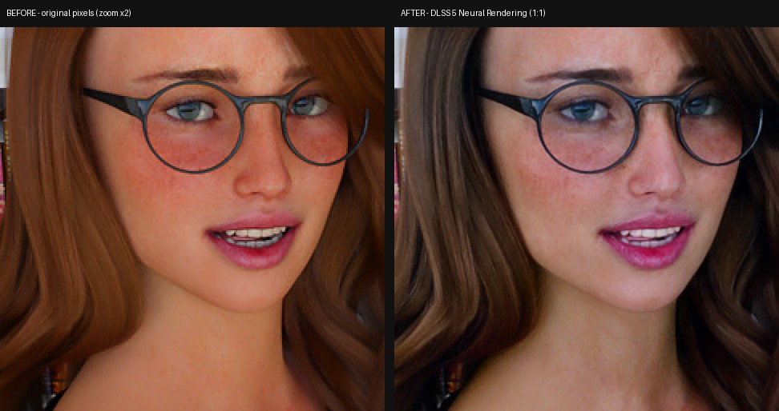
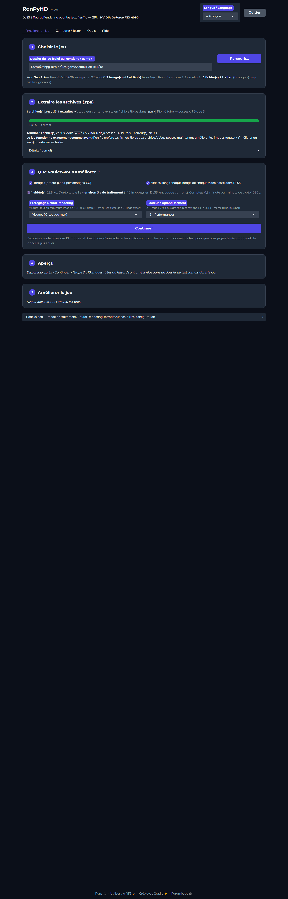
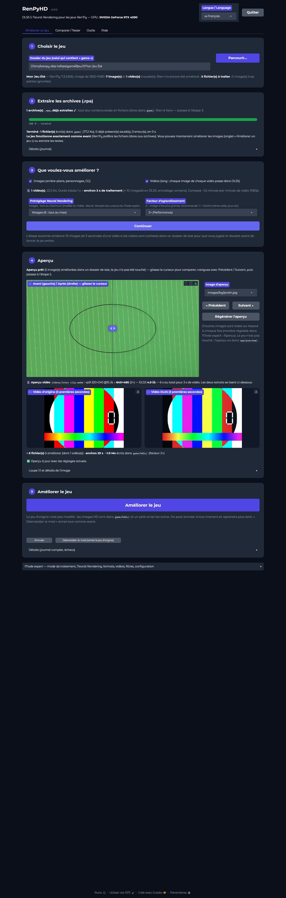
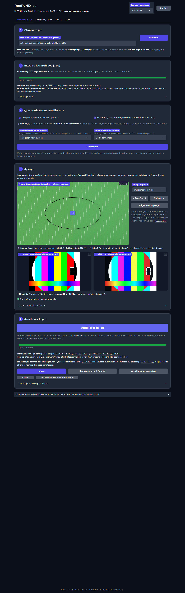
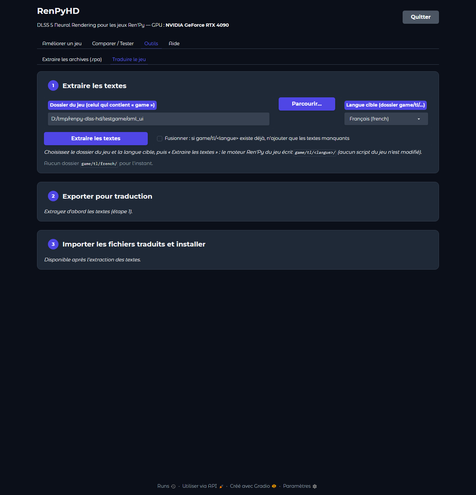
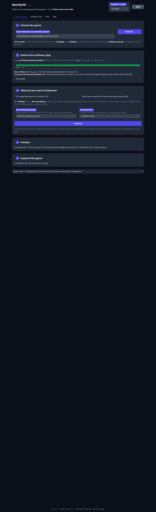
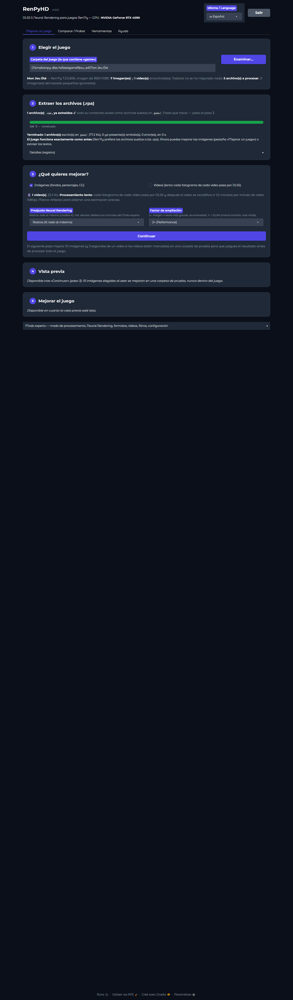

# RenPyHD — DLSS 5 upscaler, RPA extractor and translation helper for Ren'Py games

*[English version → README.md](README.md)*

**RenPyHD** applique le **DLSS 5 Neural Rendering** de NVIDIA (via le [DLSS 5 Visual Enhancer](https://github.com/Merserk/dlss5-visual-enhancer)
de Merserk) à toutes les images — et, si vous le souhaitez, aux vidéos — d'un jeu **Ren'Py**, sans toucher au jeu d'origine.
Il sait aussi **extraire les archives `.rpa`** et vous aide à **traduire un jeu** avec le système de traduction natif de Ren'Py.
Interface locale (Gradio dans une fenêtre Edge/Chrome), en français, anglais, espagnol, allemand, russe ou portugais du Brésil.
**100 % local** : rien n'est envoyé nulle part.

## Avant / après





Image d'un jeu Ren'Py, traitée avec RenPyHD, préréglage « Visages (K) », facteur 2× — fichiers en taille
réelle : [original 1280×720](docs/screenshots/readme_original_720p.jpg) · [DLSS 5 2560×1440](docs/screenshots/readme_dlss5_1440p.jpg).
Les ressources des jeux restent la propriété de leurs auteurs.

## Ce que ça fait

* **Améliorer un jeu** en cinq étapes guidées : choisir le jeu → extraire les archives `.rpa` (si besoin) → choisir
  images / vidéos, préréglage et facteur → aperçu (10 images au hasard + 3 s de vidéo, curseur avant/après, loupe 1:1,
  estimation de durée et de place) → améliorer (progression, annulation/reprise, **Jouer**, Comparer, Désinstaller).
* **Modes** : *HD 2x* (recommandé : images HD dans `game/hd2x/` + petit hook `zz_dlss_hd.rpy`, facteurs 1.5 / 1.724 / 2 / 3),
  *Remplacer sur place* (1× DLAA, originaux sauvegardés), *Suffixe `@2` natif* (Ren'Py ≥ 8.4, sans hook), *Dossier d'images libre*.
* **Vidéos** : chaque image passe dans DLSS 5 (flux optique, réinitialisation aux changements de plan), réencodage VP9 / VP8 /
  AV1 / H.264 pour Ren'Py, piste audio conservée, plafond de résolution (4K par défaut), NVENC si disponible.
* **Reprenable** : ce qui existe déjà est sauté ; les échecs sont retentés un par un ; images trop petites ignorées ;
  archives `.rpa` lues directement ; Ren'Py 7.x et 8.x.
* **Outils** : extraction `.rpa` (moteur Python intégré, reprenable) et **traduction** du jeu (extraction des textes par le
  moteur Ren'Py du jeu, export en fichiers `.txt` numérotés pour le service de traduction de votre choix, import tolérant
  avec relecture, installation d'un hook de langue avec bascule **Maj+L**).
* **Mode expert** : tous les réglages du moteur (style / preset / intensité NR, local tone & structure, skin structure,
  modèle DLSS J/K/L/M, formats et qualité de sortie, filtres, codec vidéo, CRF, plafond, audio…).

| Flux en cinq étapes | Aperçu avant/après | Fin du traitement |
|---|---|---|
|  |  |  |

| Traduire le jeu | Interface en anglais | Interface en espagnol |
|---|---|---|
|  |  |  |

## Prérequis

* **Windows 10 / 11 64 bits**.
* Carte **NVIDIA GeForce RTX 40 ou 50** (le DLSS 5 Neural Rendering ne tourne pas sur les autres cartes ; RTX 30 : chemin
  expérimental, très lent). Pilote NVIDIA récent — **≥ 610** pour l'encodage vidéo NVENC (sinon x264 logiciel, plus lent).
* Espace disque : ~1,2 Go pour le DLSS 5 Visual Enhancer, et pour chaque jeu environ **4× la taille de ses images** en 2×.
* Aucun Python, aucun SDK à installer : `setup.bat` télécharge le Visual Enhancer (qui embarque Python 3.13, FFmpeg et le
  runtime DLSS) et compile le lanceur avec le compilateur C# déjà présent dans Windows.

## Installation en 3 commandes

```bat
git clone https://github.com/Albatra/Renpy-dlss-5-upscaler.git RenPyHD
cd RenPyHD
setup.bat
```

`setup.bat` télécharge la version officielle **DLSS 5 Visual Enhancer v3.0** (467 Mo, reprise automatique si la connexion
coupe), vérifie son **SHA-256**, l'extrait dans `DLSS5\`, puis compile `RenPyHD.exe`. Sans `git` : téléchargez le zip
du dépôt (bouton *Code → Download ZIP*, ou une [release](https://github.com/Albatra/Renpy-dlss-5-upscaler/releases)),
décompressez-le et lancez `setup.bat`. Hors ligne : `setup.bat -LocalZip "C:\chemin\DLSS.5.Visual.Enhancer.v3.0.zip"`.

Puis double-cliquez sur **`RenPyHD.exe`** (ou `run.bat`). Une console s'ouvre, puis la fenêtre de l'application.

## Utilisation en 5 étapes

1. **Choisir le jeu** — *Parcourir…* et sélectionnez le dossier du jeu (celui qui contient `game\`, à côté du `.exe`).
   L'analyse est automatique : version de Ren'Py, nombre d'images et de vidéos, déjà amélioré ou non.
2. **Extraire les archives (.rpa)** — proposé seulement si des images ne sont disponibles que dans des archives.
   *Extraire les archives* (fichiers existants conservés, le jeu fonctionne pareil) ou *Passer cette étape* (lecture
   directe dans les archives). Sans archive, l'étape se passe toute seule.
3. **Que voulez-vous améliorer ?** — cases **Images** (cochée) et **Vidéos** (décochée : long, la note donne le nombre,
   la taille et la durée estimée), préréglage Neural Rendering (« Visages » par défaut) et facteur (2×). *Continuer*.
4. **Aperçu** — 10 images tirées au hasard (réglable 1–20 dans le Mode expert) et 3 secondes d'une vidéo sont améliorées
   dans `app\preview\`, jamais dans le jeu. Curseur avant/après, Précédent / Suivant, loupe 1:1, estimation
   (fichiers, durée, place disque). *Régénérer l'aperçu* tire d'autres images.
5. **Améliorer le jeu** — un seul bouton, barre de progression, temps restant, journal dans « Détails ». *Annuler*
   arrête proprement, recliquer reprend. À la fin : **Jouer**, *Comparer avant / après*, *Désinstaller le mod*
   (remet le jeu d'origine). En jeu, **Maj+H** affiche le nombre d'images remplacées.

Un jeu déjà amélioré est reconnu : les étapes s'adaptent (Jouer / Comparer / Désinstaller directement).

## Traduire un jeu (onglet Outils › Traduire le jeu)

Aucune clé d'API, aucun moteur automatique, aucun script du jeu modifié : RenPyHD s'appuie sur le système de traduction
natif de Ren'Py (`game/tl/<langue>/`).

1. **Extraire les textes** — choisissez la langue cible (`french`, `english`, `spanish`, `german`, `russian`,
   `portuguese`, `italian`, `chinese`, `japanese`, `korean`, `turkish`, `polish`…) ; le moteur Ren'Py **du jeu lui-même**
   génère `game/tl/<langue>/*.rpy` (fonctionne aussi quand les scripts sont compilés ou dans un `.rpa`).
2. **Exporter pour traduction** — fichiers `phrase_001.txt`, `phrase_002.txt`… (une ligne = un texte, `ligne1;texte`,
   balises protégées par des repères `[t1]`…). Traduisez-les avec le site ou l'outil de votre choix (par exemple
   onlinedoctranslator.com, fichier par fichier) en gardant numéros et repères.
3. **Importer et installer** — importez les `.txt` traduits (n'importe quel nom, n'importe quel ordre ; bilan traduits /
   erreurs / numéros manquants, table de relecture), puis *Installer la traduction* : le jeu démarre dans la langue choisie,
   **Maj+L** bascule entre traduction et original. *Vérifier en lançant le jeu* et *Désinstaller* sont là aussi.

## FAQ

* **Une seule instance DLSS à la fois.** Le runtime DLSS partage un journal ReShade : deux traitements simultanés
  (deux fenêtres RenPyHD, ou RenPyHD + un autre script du Visual Enhancer) se font échouer mutuellement. RenPyHD
  sérialise déjà ses propres traitements (aperçus, tests, lot) ; n'en lancez pas un autre à côté.
* **Des images sont « ignorées car trop petites ».** Les images dont le petit côté est inférieur à 256 px (icônes, boutons,
  miniatures) font échouer la vérification DLSS et n'apporteraient rien : elles sont sautées. Seuil réglable dans le Mode expert.
* **Quelles versions de Ren'Py ?** 7.x et 8.x (le hook est écrit en Python 2/3). Le mode *Suffixe `@2`* n'existe qu'à partir
  de **Ren'Py 8.4** (chargement natif des variantes `nom@2.ext`) ; en dessous, utilisez *HD 2x*.
* **Les vidéos, c'est long ?** Oui : chaque image de chaque vidéo passe dans DLSS. Mesuré sur RTX 4090 : ≈ 10 images/s en
  1080p → 4K, soit **≈ 1,5 minute de calcul par minute de vidéo 1080p**. L'estimation est affichée avant de lancer.
  Le plafond 4K est conseillé : Ren'Py décode en logiciel et ne suit pas au-delà.
* **Le jeu est intact ?** Oui. En mode HD 2x, seuls `game/hd2x/` et `game/zz_dlss_hd.rpy` sont ajoutés ; *Désinstaller le mod*
  les supprime. En mode Remplacer, les originaux sont dans `game/_dlss_backup/` ; *Restaurer les originaux* les remet.
* **Extraire les `.rpa` change quelque chose ?** Non : Ren'Py préfère les fichiers libres aux archives ; le jeu fonctionne
  avec ou sans. L'extraction ne fait que rendre les fichiers visibles et la reprise plus simple.
* **Changer la langue de l'interface ?** Menu en haut à droite, puis *Redémarrer maintenant* (ou `--lang en` en ligne de commande).

## Vie privée

RenPyHD est **100 % local** : le serveur n'écoute que sur `127.0.0.1`, aucune donnée, image ou texte n'est envoyé nulle part,
la télémétrie Gradio est désactivée. Le seul accès réseau est le téléchargement du DLSS 5 Visual Enhancer par `setup.bat`
(depuis GitHub). La traduction elle-même se fait avec le service **que vous** choisissez, en dehors de RenPyHD.

## Contenu du dépôt

```
app\          renpy_hd_app.py (interface), renpy_hd_core.py (moteur), renpy_hd_tools.py (.rpa, traduction),
              renpy_hd_i18n.py + i18n\*.json (langues), zz_dlss_hd.rpy (hook Ren'Py), README.md (doc détaillée)
launcher\     launcher.cs + build_launcher.bat (RenPyHD.exe, compilé par setup.bat)
tools\        README.md : rpaExtract.exe optionnel (non fourni)
setup.bat / setup.ps1   installation ; run.bat : lancement sans l'exe ; build_release.ps1 : zip de release
DLSS5\        (créé par setup.bat, ignoré par git) DLSS 5 Visual Enhancer : Python 3.13, moteur DLSS, FFmpeg
```

Documentation détaillée (modes, vidéos, codecs, traduction, limites) : [`app/README.md`](app/README.md).
Un bug ? Ouvrez une [issue](https://github.com/Albatra/Renpy-dlss-5-upscaler/issues) avec le journal de la console.

## Crédits et licences

* RenPyHD : © 2026 Valentin Levavasseur, licence **MIT** ([LICENSE](LICENSE)).
* [DLSS 5 Visual Enhancer](https://github.com/Merserk/dlss5-visual-enhancer) par **Merserk** (MIT) — téléchargé par
  `setup.bat`, non redistribué ici ; il embarque le runtime **NVIDIA DLSS / NGX** (licence NVIDIA RTX SDK), **FFmpeg**
  (GPLv3), **ReShade** (BSD-3), **RenoDX** (MIT), **Python** (PSF) et **Gradio** (Apache-2.0).
* `rpaExtract.exe` (optionnel, non fourni) : enveloppe d'**unrpa** (GPLv3).
* Détail : [THIRD_PARTY.md](THIRD_PARTY.md). Historique : [CHANGELOG.md](CHANGELOG.md).
* Ren'Py est un projet de Tom Rothamel et contributeurs. Les images et textes des jeux traités appartiennent à leurs auteurs.
